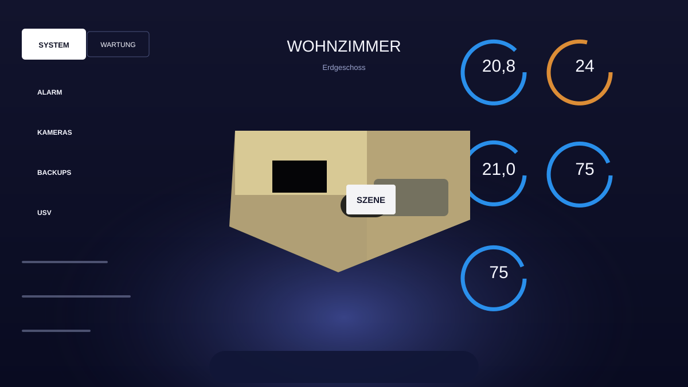

# HA Neo Dashboard

[](https://my.home-assistant.io/redirect/hacs_repository/?owner=HOCHH4U5JUMP3R&repository=ha-dashboard&category=plugin)



HA Neo Dashboard ist eine HACS-kompatible **Fullscreen-Lovelace-Dashboard-Card** im dunklen, futuristischen Stil der Referenzgrafik. Sie ist nicht als kleine Kachel gedacht, sondern für eine Lovelace-View mit `panel: true`: linke Systemspalte, zentrale Hauptfläche, rechte Gauges und eine untere Navigation für mehrere interne Dashboard-Seiten.

## HACS-Installation

1. Öffne HACS in Home Assistant.
2. Gehe zu **Frontend** bzw. **Dashboards**.
3. Füge dieses Repository als benutzerdefiniertes Repository hinzu:
   - Repository: `HOCHH4U5JUMP3R/ha-dashboard`
   - Kategorie: `Dashboard`
4. Installiere **HA Neo Dashboard**.
5. Leere den Browser-Cache bzw. lade Home Assistant neu.
6. Erstelle eine neue Lovelace-View mit `panel: true` und einer Karte vom Typ `custom:ha-neo-dashboard`.

HACS installiert die Ressource aus `dist/ha-dashboard.js`. Die Datei heißt bewusst wie das Repository, damit die HACS-Dashboard/Plugin-Struktur erkannt wird.

## Fullscreen-Verwendung

Eine vollständige View liegt unter `dist/neo-living-room-card.yaml`. Wichtig ist `panel: true`, damit Home Assistant die Card nicht in ein normales Kartenraster setzt:

```yaml
title: Neo Home
views:
  - title: Neo Dashboard
    path: neo-dashboard
    panel: true
    cards:
      - type: custom:ha-neo-dashboard
        title: LIVING ROOM
        subtitle: Ground floor
        background_image: /local/neo-dashboard/background.jpg
        image: /local/neo-dashboard/living-room.png
```

Wenn du zusätzlich eine echte Kiosk-Ansicht möchtest, kannst du Home Assistants Sidebar/Header mit einem separaten Kiosk-Setup ausblenden. Die Card selbst füllt die Panel-View bereits mit `min-height: 100vh`.

## Anpassbare Inhalte

Alle sichtbaren Bereiche sind über YAML konfigurierbar:

| Option | Zweck |
| --- | --- |
| `background_image` | Eigenes Fullscreen-Hintergrundbild hinter Glow und Panels. |
| `image` | Zentraler Wohnzimmer-/Raum-Render auf der Overview-Seite. |
| `top_tabs` | Reiter links oben, z. B. System- und Maintenance-Aktionen. |
| `systems` | Linke Statusliste mit Icon, Entity, Label, Farbe und Aktion. |
| `metrics` | Linke Balkenwerte mit Entity, Maximalwert, Einheit und Aktion. |
| `gauges` | Rechte runde Karten mit Entity, optionaler `value_entity`, Einheit, Farbe und Aktion. |
| `pages` | Untere Navigation und interne Seiten mit beliebig vielen Funktionskacheln. |

## Funktionen und Aktionen

Jede Systemzeile, Metrik, Gauge, Kachel und jeder optionale Reiter kann eine `tap_action` erhalten. Unterstützt werden:

```yaml
tap_action:
  action: toggle
  entity: light.living_room_all
```

```yaml
tap_action:
  action: more-info
  entity: climate.living_room
```

```yaml
tap_action:
  action: call-service
  service: scene.turn_on
  target:
    entity_id: scene.living_room_movie
```

```yaml
tap_action:
  action: navigate
  navigation_path: /lovelace/security
```

```yaml
tap_action:
  action: url
  url_path: https://www.home-assistant.io/
```

Ohne `tap_action` öffnet eine Kachel mit `entity` standardmäßig `more-info`. Die unteren Reiter wechseln ohne eigene `tap_action` intern zwischen Seiten; mit `tap_action` können sie stattdessen navigieren oder Dienste auslösen.

## Mehrere Dashboard-Seiten

Die untere Navigation wird über `pages` gesteuert. Eine Seite mit `type: overview` zeigt die zentrale Raumgrafik. Alle anderen Seiten rendern konfigurierbare Funktionskacheln:

```yaml
pages:
  - id: overview
    label: Overview
    icon: mdi:rocket-launch
    type: overview
  - id: lights
    label: Lights
    title: LIGHTS
    subtitle: Room ambience
    icon: mdi:lightbulb-on-outline
    tiles:
      - name: All lights
        entity: light.living_room_all
        icon: mdi:lightbulb-group
        tap_action:
          action: toggle
          entity: light.living_room_all
      - name: Movie light
        icon: mdi:movie-open
        label: Run scene
        tap_action:
          action: call-service
          service: scene.turn_on
          target:
            entity_id: scene.living_room_movie
```

## Bilder

Lege deine Assets in Home Assistant z. B. so ab:

```text
config/www/neo-dashboard/living-room.png
config/www/neo-dashboard/background.jpg
```

In Lovelace sind sie anschließend über `/local/neo-dashboard/living-room.png` und `/local/neo-dashboard/background.jpg` erreichbar.

## Optionales Theme

Das Theme bleibt unter `themes/neo-dashboard.yaml` enthalten. Wenn du es zusätzlich nutzen möchtest, kopiere es in deinen Home-Assistant-Ordner `config/themes/` oder verwende dieses Repository separat als HACS-Theme-Quelle.

Aktiviere Themes in `configuration.yaml`:

```yaml
frontend:
  themes: !include_dir_merge_named themes
```

## Entwicklung

Die installierbare HACS-Card befindet sich in `dist/ha-dashboard.js`. Die Beispiel-View liegt in `dist/neo-living-room-card.yaml`, damit die für die Dashboard-Resource relevanten Dateien am HACS-kompatiblen Ort liegen.
